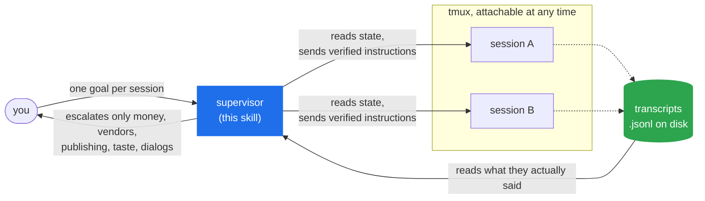

# /supervise

You give it a goal and walk away. `/supervise` turns one Claude Code session into a foreman
for your others, as many as your machine will hold, running in tmux where you can watch
every keystroke.

```text
/plugin marketplace add aldhosutra/supervise
/plugin install supervise@aldhosutra
```

```text
/supervise 9513c215 4f2b1a08
```

It asks what each session's job is and what finished looks like, then keeps them at it.

## How it works



The terminal is read for signals and never for content. A pane scrolls, so a long reply read
that way arrives as its tail; the transcript on disk has all of it.

## What a supervisor does

It keeps the sessions working. They stall between tasks, so it picks the next one and sends
it, which saves you eight hours of typing "continue".

It checks the work. It reads the diff, runs the tests, renders the page. "All tests pass" is
a claim; a green run you triggered is evidence. A supervisor that forwards claims adds
latency and nothing else.

It answers their questions rather than passing them along. When a session hits an open
question, it works a ladder: the project's own docs first, then research, and where the
system can be asked directly, a measurement instead of a citation. Only after that does it
come to you, with the findings and a recommendation attached.

It wakes you for money, vendors, publishing, matters of taste, and permission dialogs, and
handles the rest itself. Ten hours of unattended work should cost you four decisions rather
than four hundred.

## How many at once?

There is no limit in the tool. Polling 100 panes takes 0.62s, so a thousand would cost about
six seconds per cycle. Two things outside it bind first.

Your RAM is the hard floor. A Claude session holds 275 to 390 MB, which works out to roughly
8 on an 8 GB laptop, 20 on 16 GB, and 100 or more on a real workstation.

Review is the other limit, and the more interesting one. Past a certain point a supervisor
stops reading diffs and starts sampling, and a sampling supervisor is really doing dispatch,
which native subagents already handle better. Run as many as your machine holds, but six
sessions genuinely reviewed are worth more than sixty glanced at.

## Why not just use subagents?

Use them. For short parallel fan-out, like searching six directories or reviewing four
files, native subagents are simpler and cheaper.

A subagent is a function call. A supervised session is a process. You call a subagent, it
computes, it returns, and its context is destroyed; that isolation is the whole reason it
exists.

`/clear` shows the difference. You cannot `/clear` a subagent, because there is nothing left
to continue. So context lifecycle becomes something a supervisor decides: when should this
session forget, and what has to survive the forgetting?

Reach for `/supervise` when the work is long, when you want to watch it happen, and when the
session should still be around tomorrow.

## Built the hard way

Three decisions, each from something that broke.

The terminal lies, so it is only used for signals. `tmux send-keys` silently truncated a
1,200-character instruction to its last 232 characters, mid-word, without an error anywhere.
`capture-pane` returns only what is left in the scrollback, and reading a long report that
way once lost its first half, which happened to contain a correction to the supervisor's own
work. State comes from the terminal. Content always comes from the transcript on disk.

Session IDs move and terminals do not. Every `/clear` mints a new session ID, so a
supervisor holding the old one watches a dead file and concludes all is quiet. Every
transcript also carries a `bridgeSessionId` that never changes:

```text
cse_01Pn48ur…  →  b47163fa → d8c95e98 → 2a11f9a9 → 9513c215
                  one terminal, three /clears, four session IDs
```

Hand it any ID in that chain and it finds the live one.

Nothing is sent unverified. Instructions over 120 characters are refused outright. The input
is cleared first, because Claude Code renders suggestions there and a bare Enter would submit
one nobody wrote. The text is then checked character for character before Enter is pressed.

## The toolkit

Six scripts, useful on their own:

```bash
sv-launch.sh work ~/code/myproject     # start a session, print how to attach
sv-resolve.py --list                   # every session ↔ its tmux pane
sv-state.sh work:0.0                   # BUSY | IDLE | PROMPT | UNKNOWN | GONE
sv-read.py --session <id> --turns 2    # what it really said, from the transcript
sv-send.sh work:0.0 "Continue."        # types it, verifies it, then hits Enter
sv-watch.sh work:0.0 work:0.1 api:0.0  # one line per state change worth acting on
```

`sv-launch.sh` starts sessions detached rather than hidden. It hands you
`tmux attach -t work`, so you can watch live and take the keyboard whenever you like.

## Install

As a plugin, which `/plugin update` then keeps current:

```text
/plugin marketplace add aldhosutra/supervise
/plugin install supervise@aldhosutra
```

Or in one line:

```bash
curl -fsSL https://raw.githubusercontent.com/aldhosutra/supervise/main/install.sh | bash
```

Or from a clone: `./install.sh` installs it for every project, `./install.sh --project` for
this one only.

Needs `tmux`, `python3`, Claude Code. macOS and Linux. Nothing else.

## It will never

Answer a permission dialog for you, spend your money, commit you to a vendor, publish
anything, decide a matter of your taste, or relay a claim it has not checked.

## Read more

[SKILL.md](plugins/supervise/skills/supervise/SKILL.md) covers what the supervisor does,
step by step.

[policy.md](plugins/supervise/skills/supervise/references/policy.md) explains why each rule
exists, including the failure this kind of work keeps producing: code that is correct and
never reached. Seven variants turned up in one project, every one passing its own tests.

[troubleshooting.md](plugins/supervise/skills/supervise/references/troubleshooting.md) is
for when the mapping, the dialogs, or the silence go wrong.

MIT.
