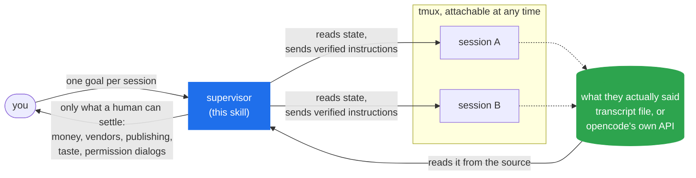
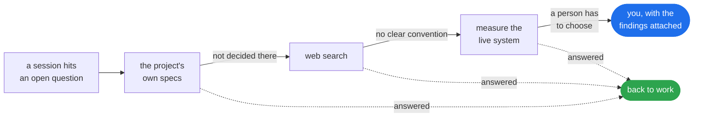

# /supervise

[](https://github.com/aldhosutra/supervise/releases)
[](LICENSE)


You give it a goal and walk away. `/supervise` turns one coding-agent session into a foreman
for your others, as many as your machine will hold, running in tmux where you can watch every
keystroke. It supervises **Claude Code and opencode**, and can drive both at once.

The reason you can walk away is that it resolves their questions instead of forwarding them.
When a session gets stuck on something undecided, the supervisor digs through the project's
own documents, searches the web, and measures the real answer where the system can be asked
directly. It comes back to you only for the things a human has to settle.

## Installation

With the Skills CLI:

```bash
npx skills add aldhosutra/supervise --global
```

Leave off `--global` to install into the current project only. The skill answers to
`/supervise`.

Claude Code can install it as a plugin instead, which `/plugin update` then keeps current:

```text
/plugin marketplace add aldhosutra/supervise
/plugin install supervise@aldhosutra
```

Or in one line, without either:

```bash
curl -fsSL https://raw.githubusercontent.com/aldhosutra/supervise/main/install.sh | bash
```

**opencode** reads `~/.claude/skills` too, so any of the routes above installs it there as
well — and the `curl` one also adds opencode's `/supervise` command. The plugin route is
Claude Code only.

Needs `tmux`, `python3`, and at least one of Claude Code or opencode. macOS and Linux. The
supervised sessions have to be one of those two: the supervisor itself can be either.

## Usage

Give it the session IDs you want supervised:

```text
/supervise 9513c215 4f2b1a08
```

It asks what each session's job is and what finished looks like, then keeps them at it. If a
session is not running yet it starts one and tells you how to attach.

## How it works



The terminal is read for signals and never for content. A pane scrolls, so a long reply read
that way arrives as its tail; the agent's own record has all of it — a `.jsonl` transcript
for Claude Code, and for opencode the HTTP server it serves when started with a pinned port
(which `sv-launch.sh` always sets). Wake-ups ride the pane itself, so they need no server.

When a session hits something undecided, the supervisor does not pass it to you. It works
down a ladder and stops at the first rung that settles the question:



Most questions are settled on the first or second rung and you never see them.

## What a supervisor does

It keeps the sessions working. They stall between tasks, so it picks the next one and sends
it, which saves you eight hours of typing "continue".

It checks the work. It reads the diff, runs the tests, renders the page. "All tests pass" is
a claim; a green run you triggered is evidence. A supervisor that forwards claims adds
latency and nothing else.

It answers their questions rather than passing them along, which is the part that decides
whether you can actually leave. A session that stops on every unstated decision is a session
you are still babysitting. So the supervisor works a ladder, and stops at the first rung that
settles it:

1. The project's own specs and principles. A surprising number of "open questions" were
   already decided by something the project wrote down and the session had not connected.
2. Web search, for a convention or a published standard.
3. A measurement, when the system can be asked directly. A number you measured beats a
   number you cited.

Only after all three does it come to you, and then with the findings and a recommendation
attached rather than a bare question.

Some things it will not decide, and escalates immediately without working the ladder: money,
vendors, publishing, matters of taste, and permission dialogs. Ten hours of unattended work
should cost you four decisions rather than four hundred.

## Why not just use subagents?

Use them. For short parallel fan-out, like searching six directories or reviewing four
files, native subagents are simpler and cheaper.

A subagent is a function call. A supervised session is a process. You call a subagent, it
computes, it returns, and its context is destroyed; that isolation is the whole reason it
exists.

`/clear` shows the difference. You cannot `/clear` a subagent, because there is nothing left
to continue. So context lifecycle becomes something a supervisor decides: when should this
session forget, and what has to survive the forgetting?

Reach for `/supervise` when the work is long, when you want to watch it happen, and when the
session should still be around tomorrow.

## The toolkit

Useful on their own:

```bash
sv-capability.py                       # can this supervisor be woken, and how
sv-launch.sh work ~/code/myproject     # start a session, print how to attach
sv-resolve.py --list                   # every session ↔ its tmux pane
sv-state.sh work:0.0                   # BUSY | IDLE | PROMPT | UNKNOWN | GONE
sv-read.py --session <id> --turns 2    # what it really said, from its own record
sv-send.sh work:0.0 "Continue."        # delivers it, verifies it, then submits
sv-watch.sh work:0.0 work:0.1 api:0.0  # one line per state change worth acting on
```

Every one of them works out which agent is in the pane and adapts. `sv-launch.sh work
~/code/proj --agent opencode` picks explicitly; with only one of the two installed, it
needs no flag.

`sv-launch.sh` starts sessions detached rather than hidden. It hands you
`tmux attach -t work`, so you can watch live and take the keyboard whenever you like.

Each agent breaks in its own way, and the scripts know the difference. A Claude Code
session's ID changes every time you run `/clear`, so `sv-resolve.py` tracks the
`bridgeSessionId` that stays constant for the terminal instead — hand it any ID a session
has ever had and it finds the live one. An opencode session keeps its ID, but is only
readable through the server of the TUI that owns it, and a TUI serves one only when started
with `--port` — so `sv-launch.sh` pins one and a hand-opened TUI falls back to reading the
screen. One consequence worth knowing: `tmux send-keys` truncates, so instructions to
Claude Code are capped at 120 characters and anything longer goes in a file, while opencode
takes an instruction of any length — `sv-send.sh <pane> --file <path>` sends a whole one.

## Waking a supervisor on opencode

Claude Code has a monitor shell: its completion re-invokes the supervisor. opencode has
nothing like it, so `sv-watch.sh` wakes the supervisor itself, by typing a protocol line
into its own tmux pane the moment a supervised session changes state. That is why an
opencode supervisor runs inside tmux: the pane is the only channel that reaches it.

It is not a keystroke and a hope. opencode queues a submitted prompt even mid-turn, so the
wake lands whether the supervisor is busy or idle; but the wake is only treated as delivered
once its token shows up in the supervisor's own message history, and retried otherwise.
A dialog is the one state wakes are held for, and the watcher watches the supervisor's pane
too, so it can say `SUPERVISOR-PROMPT` rather than silently stall.

## It will never

Answer a permission dialog for you, spend your money, commit you to a vendor, publish
anything, decide a matter of your taste, or relay a claim it has not checked.

## Read more

[SKILL.md](plugins/supervise/skills/supervise/SKILL.md) covers what the supervisor does,
step by step.

[policy.md](plugins/supervise/skills/supervise/references/policy.md) explains why each rule
exists, including the failure this kind of work keeps producing: code that is correct and
never reached. Seven variants turned up in one project, every one passing its own tests.

[troubleshooting.md](plugins/supervise/skills/supervise/references/troubleshooting.md) is
for when the mapping, the dialogs, or the silence go wrong.

MIT.
